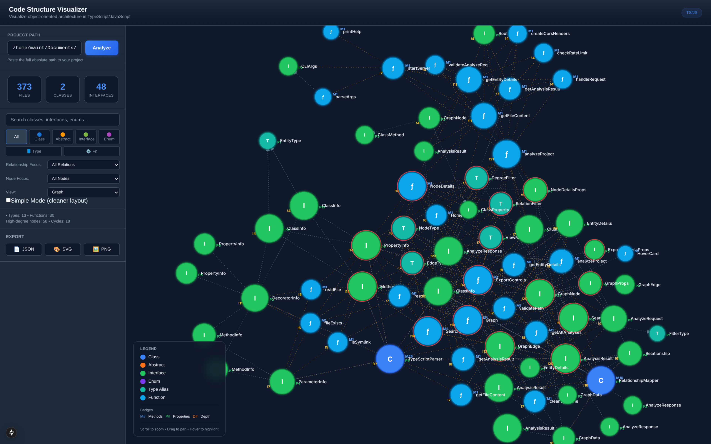
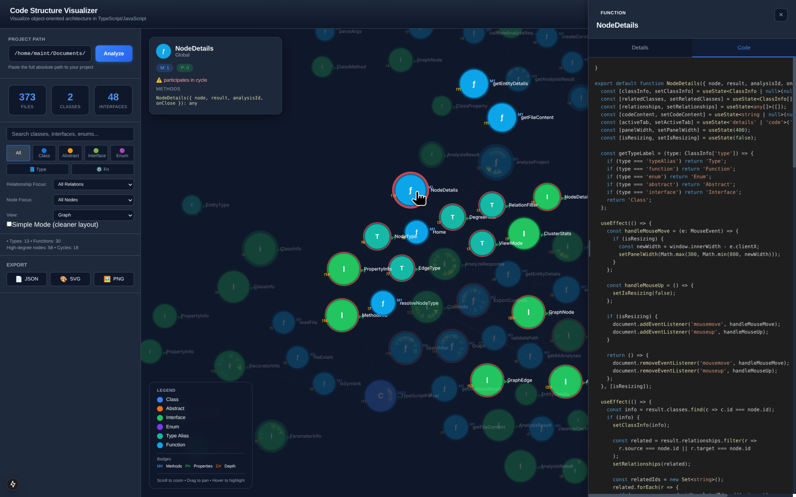
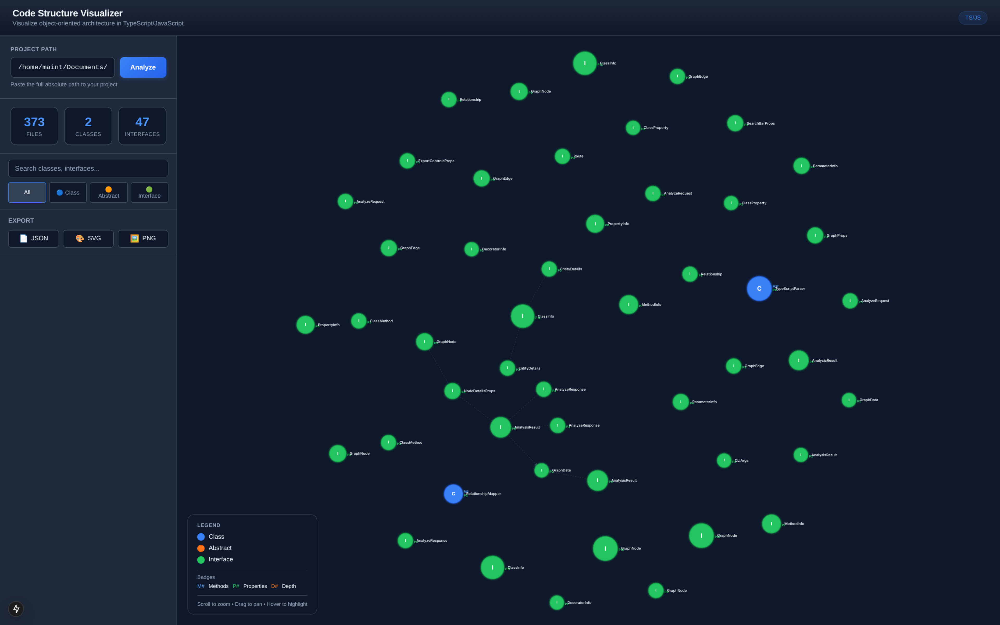
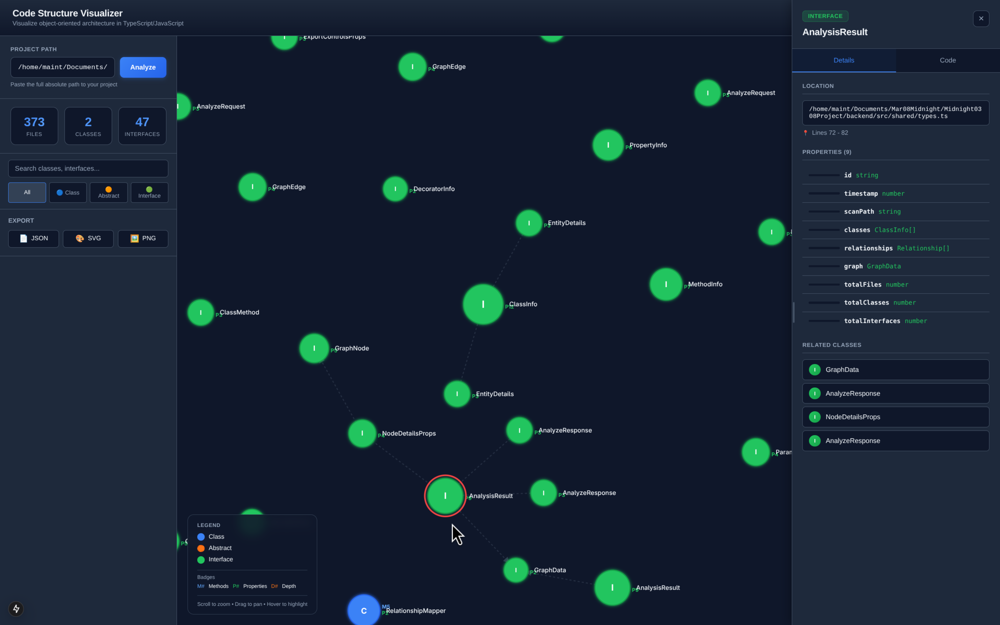
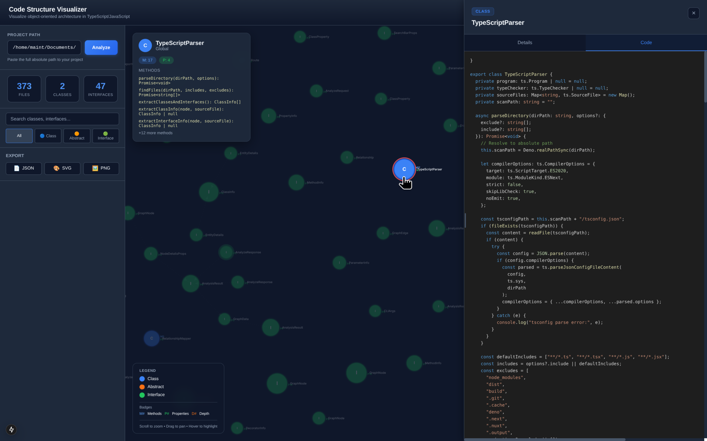
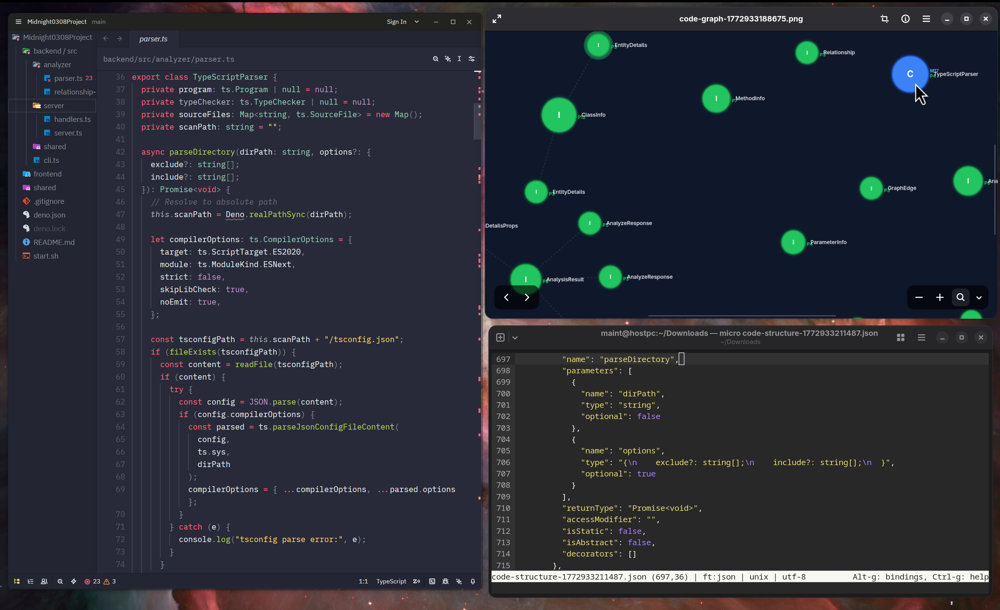

# Code Structure Visualizer

A localhost TypeScript-based code analysis tool for visualizing object-oriented structure in JavaScript and TypeScript projects. The tool scans source files, extracts classes and interfaces, maps inheritance and implementation relationships, and presents the result as an interactive architecture graph with detailed entity inspection.

### Main Cluster


## Overview

Code Structure Visualizer is designed to help developers understand and explore the architecture of TypeScript and JavaScript codebases. By analyzing the object-oriented structure, it provides insights into:

- Class and interface relationships (inheritance, implementation)
- Code complexity indicators
- Method and property distributions
- Inheritance depth analysis

This tool is particularly useful for:
- Learning new codebases
- Understanding architectural patterns
- Identifying code organization
- Refactoring planning

### Code Pannel


## Features

### Interactive Graph Visualization

- **D3.js-powered force-directed graph** with smooth pan, zoom, and drag interactions
- **Visual node differentiation** by type:
  - Classes (blue circles)
  - Abstract classes (orange circles with dashed borders)
  - Interfaces (green circles)
- **Node sizing** based on complexity (number of methods + properties)
- **Relationship lines** showing:
  - Extends relationships (solid arrows)
  - Implements relationships (dashed arrows)
  - Composition/usage lines

### Rich Entity Information

- **Hover cards** displaying:
  - Entity name and type badge
  - Method count (M#)
  - Property count (P#)
  - Inheritance depth indicator (D#)
- **Click-to-select** with connected relationship highlighting
- **Detailed inspection panel** with:
  - File location and line numbers
  - Namespace information
  - Full method and property lists with types
  - Decorator information
  - Related classes and interfaces

### Code Inspection

- **Syntax-highlighted source code** view using Prism.js
- **Line number navigation** to relevant code sections
- **Tab-based interface** for switching between details and code views

### Search and Filtering

- **Filter by type**: Show/hide classes, interfaces, or abstract classes
- **Search by name**: Quick search across all entities
- **Combined filtering** for precise exploration

### Export Capabilities

- **JSON export**: Full analysis data for further processing
- **SVG export**: Vector graphics for documentation
- **PNG export**: Raster images for sharing

## Screenshots

### Main Interface


### Graph Visualization


### Node Details Panel


### Code View


## Technology Stack

### Backend (Deno Runtime)

- **Deno 2.x** - Modern TypeScript runtime
- **TypeScript Compiler API** - For parsing and analyzing TypeScript source code
- **Custom HTTP server** - Lightweight API endpoints

### Frontend (Next.js)

- **Next.js 15** - React framework with server-side rendering
- **D3.js 7** - Data-driven document manipulation for graph visualization
- **Prism.js** - Syntax highlighting for code display
- **React 18** - UI component library

### Architecture

```
┌─────────────────┐     ┌─────────────────┐
│   Frontend      │────▶│   Backend       │
│   (Next.js)     │◀────│   (Deno)        │
│   Port: 3001    │     │   Port: 8000    │
└─────────────────┘     └─────────────────┘
```

## Getting Started

### Prerequisites

- **Deno 2.x** or higher (https://deno.land/)
- **Node.js 18+** (for Next.js frontend)
- **npm** or **pnpm**

### Installation

1. Clone the repository:
```bash
git clone <repository-url>
cd code-structure-visualizer
```

2. Install frontend dependencies:
```bash
cd frontend
npm install
```

3. Return to project root:
```bash
cd ..
```

### Running the Application

#### Single Command: Build and Run

The easiest way to start the application is with a single command:

```bash
./start.sh
```

This script will:
1. Install frontend dependencies (npm install)
2. Start the backend API server on port 8000
3. Start the frontend development server on port 3001
4. Display the URLs and keep both services running

Press `Ctrl+C` to stop all services.

#### Manual Startup

If you prefer to run the services separately:

**Start the backend:**
```bash
deno task start
```
or
```bash
deno run --allow-read --allow-net --allow-env backend/src/cli.ts
```

**Start the frontend (in a new terminal):**
```bash
cd frontend
npm run dev
```

### Access the Application

Open your browser and navigate to:
- **Frontend**: http://localhost:3001
- **Backend API**: http://localhost:8000

## Usage Guide

### Analyzing a Project

1. Enter the absolute path to a TypeScript or JavaScript project directory in the input field
2. Click "Analyze" to start the analysis
3. Wait for the graph to render

### Navigating the Graph

- **Pan**: Click and drag on empty space
- **Zoom**: Mouse wheel or pinch gesture
- **Drag nodes**: Click and drag individual nodes
- **Hover**: View entity summary card
- **Click**: Select node and show details panel
- **Double-click**: Center view on node

### Using the Details Panel

1. Click on any node to open the details panel
2. Switch between "Details" and "Code" tabs
3. Drag the left edge to resize the panel
4. Click the X button to close

### Filtering and Searching

- Use the filter buttons to show/hide specific entity types
- Type in the search bar to filter by name
- Filters can be combined

### Exporting Analysis

Click the export button to save:
- JSON for data processing
- SVG for vector graphics
- PNG for images

## Project Structure

```
code-structure-visualizer/
├── backend/
│   ├── src/
│   │   ├── analyzer/
│   │   │   ├── parser.ts              # TypeScript Compiler API wrapper
│   │   │   └── relationship-mapper.ts # Relationship mapping logic
│   │   ├── server/
│   │   │   ├── handlers.ts            # API endpoint handlers
│   │   │   └── server.ts              # HTTP server
│   │   ├── shared/
│   │   │   └── types.ts               # TypeScript interfaces
│   │   └── cli.ts                     # Command-line interface
│   └── deno.json                      # Deno configuration
├── frontend/
│   ├── src/
│   │   ├── app/
│   │   │   ├── page.tsx               # Main application page
│   │   │   └── page.css               # Main styles
│   │   ├── components/
│   │   │   ├── Graph.tsx              # D3.js graph component
│   │   │   ├── NodeDetails.tsx        # Details panel
│   │   │   ├── SearchBar.tsx          # Search and filter
│   │   │   └── ExportControls.tsx     # Export functionality
│   │   └── lib/
│   │       └── api.ts                 # API client
│   ├── package.json                   # Node.js dependencies
│   └── next.config.js                 # Next.js configuration
├── shared/
│   └── types.ts                       # Shared type definitions
├── deno.json                          # Root Deno configuration
└── start.sh                           # Startup script
```

## API Endpoints

| Endpoint | Method | Description |
|----------|--------|-------------|
| `/api/analyze` | POST | Analyze a project directory |
| `/api/result/:id` | GET | Get analysis result by ID |
| `/api/entity/:id` | GET | Get entity details by ID |
| `/api/file` | GET | Get file content (requires analysisId) |

### Analyze Request

```json
{
  "path": "/path/to/project",
  "exclude": ["node_modules", "dist"],
  "include": ["**/*.ts", "**/*.tsx"]
}
```

## Development

### Running Tests

Tests can be added using Deno's built-in test runner:
```bash
deno test
```

### Building for Production

**Frontend:**
```bash
cd frontend
npm run build
npm start
```

### Adding Features

The codebase is organized into clear modules:

- **Parser** (`backend/src/analyzer/parser.ts`): Handles TypeScript source code parsing
- **Relationship Mapper** (`backend/src/analyzer/relationship-mapper.ts`): Builds entity relationships
- **Graph Component** (`frontend/src/components/Graph.tsx`): D3.js visualization
- **API Client** (`frontend/src/lib/api.ts`): Backend communication

## Limitations

- Currently supports only local project analysis (not remote URLs)
- Requires TypeScript source files for full analysis
- Large projects may take longer to analyze
- Graph visualization works best with medium-sized codebases (50-500 entities)

## Troubleshooting

### No files found

Ensure the path points to a directory containing TypeScript (.ts, .tsx) or JavaScript (.js, .jsx) files.

### Graph not rendering

Check browser console for errors. Ensure the project contains classes or interfaces to visualize.

### Slow performance

Try filtering to show fewer entity types, or analyze a specific subdirectory.

## License

MIT License

---

Built with Deno, Next.js, and D3.js
