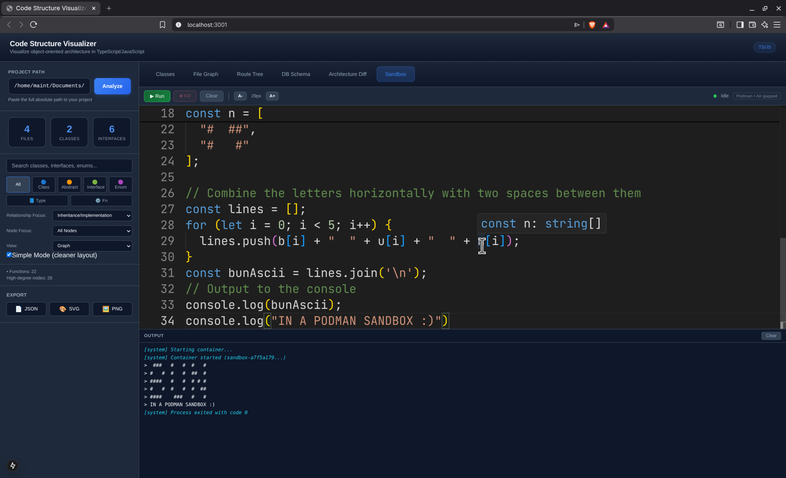

# Code Structure Visualizer

Local-first architecture explorer for TypeScript/JavaScript projects.

It combines a Deno analysis backend with a Next.js + D3 frontend and now ships with six analysis tabs:

1. **Classes**: OOP relationship graph + cluster/table view
2. **File Graph**: hierarchical import-aware file tree
3. **Route Tree**: discovered HTTP/page routes (Next.js + Express-style)
4. **DB Schema**: Prisma/Drizzle model and relation map
5. **Architecture Diff**: compare code structure between git references
6. **Sandbox**: isolated Bun.js code execution environment (Podman container)


---

## What You Can Explore

### 1) Classes Tab

- Class/interface/abstract/enum/type/function extraction from TS/JS source
- Relationship graph (`extends`, `implements`, `composition`, `uses`, `imports`)
- Degree/cycle metadata (high-degree detection + cycle markers)
- View modes:
  - **Graph**: force-directed architecture map
  - **Clusters**: grouped table cards with edge breakdowns
- Entity inspection panel with details + source-code view
- Export controls (JSON, SVG, PNG)


### 2) File Graph Tab

- Import graph from static + dynamic imports (`import` / `import()`)
- File classification (`page`, `api`, `component`, `lib`, `config`, `util`)
- Hierarchical tree built from project-relative file paths
- Expand/collapse folders, search, and type filters
- Vertical scroll behavior for deep trees


### 3) Route Tree Tab

- Framework detection and route discovery for:
  - Next.js App Router (`app/`, `src/app/`)
  - Next.js Pages Router (`pages/`, `src/pages/`)
  - Express-style route declarations (`app.get`, `router.post`, etc.)
- Method extraction for route handlers (GET/POST/PUT/DELETE/PATCH/HEAD/OPTIONS)
- Merged method display for shared route paths
- Expand/collapse tree navigation with hover metadata


### 4) DB Schema Tab

- Prisma schema parsing (`schema.prisma`)
- Drizzle table + relation parsing (`pgTable/mysqlTable/sqliteTable`, `references`, `relations()`)
- Model cards with field metadata (`id`, `unique`, optionality, relation hints)
- Directed relation rendering with type-aware styling


### 5) Architecture Diff Tab (NEW)

- Compare code structure between any two git references (branches, tags, commits)
- Side-by-side graph visualization with synchronized zoom/pan
- Entity change detection:
  - **Added**: new classes, interfaces, enums, type aliases, functions
  - **Removed**: deleted entities
  - **Modified**: changed methods, properties, inheritance
- Relationship change tracking:
  - New dependencies and imports
  - Broken relationships from removed code
- Impact analysis showing affected dependencies
- Filter controls for change types (added/removed/modified)
- Dual view modes:
  - **Graph**: side-by-side architecture comparison
  - **List**: detailed change list with entity breakdown


### 6) Code Sandbox Tab

A fully isolated JavaScript/TypeScript execution environment powered by Bun inside a Podman container. Write code in a Monaco Editor, execute it with a single click, and see real-time streaming output — all without any risk to the host system.

**Editor features:**
- Full Monaco Editor with TypeScript language support, syntax highlighting, and autocomplete
- Dark theme (`vs-dark`) matched to the application's Mission Telemetry design
- Zoom in/out controls (A-/A+) to adjust editor font size (8px–32px range)
- Word wrap, auto-layout, and 2-space tab indentation

**Execution controls:**
- **Run**: Sends code to the backend, which spins up a new Podman container and streams output back via Server-Sent Events (SSE)
- **Kill**: Terminates a running container mid-execution (useful for infinite loops or long-running code)
- **Clear**: Clears the output panel
- Live status indicator: green (idle), cyan pulse (running), red (error), amber (killed)

**Output panel:**
- Real-time streaming of stdout (white) and stderr (red) from the container
- System messages (cyan, italic) for container lifecycle events (started, exited, killed)
- Auto-scrolls to latest output
- Capped at 10,000 lines to prevent memory issues



**Container isolation (security model):**

Each execution creates a fresh, disposable Podman container with strict sandboxing:

| Layer | Protection |
|-------|-----------|
| **Network** | `--network=none` — completely air-gapped, no internet access |
| **Filesystem** | `--read-only` root filesystem; code mounted read-only |
| **Memory** | `--memory=256m` hard cap |
| **CPU** | `--cpus=1` single-core limit |
| **Time** | `--timeout=30` — Podman kills the container after 30 seconds |
| **Host access** | Zero — rootless Podman, no host bind mounts except the code file |
| **Process** | Container destroyed (`--rm`) immediately after execution |
| **Temp dirs** | `/tmp` and `/home/bun` mounted as `tmpfs` with `noexec,nosuid` |

The container uses the `oven/bun:1-slim` image, built once and reused for all executions. The `start.sh` script automatically checks for and builds this image on first run.

**Architecture:**

```text
Frontend (Next.js:3001)          Backend (Deno:8000)              Podman Container
┌──────────────────┐   POST/SSE   ┌─────────────────┐   podman   ┌──────────────┐
│ Monaco Editor    │────────────>│ /api/sandbox/   │──run────>│ oven/bun     │
│ Output Terminal  │<──SSE stream─│ execute         │<──pipe───│ bun run code │
│ Run/Kill/Clear   │   POST       │ /api/sandbox/   │  podman   │              │
│                  │────────────>│ kill            │──kill───>│              │
└──────────────────┘              └─────────────────┘           └──────────────┘
```

---

## Architecture

```text
Frontend (Next.js, port 3001)  <----HTTP---->  Backend (Deno, port 8000)
```

- **Frontend** handles rendering, filtering, tab state, and interaction.
- **Backend** performs filesystem scanning, parsing, and analysis.
- **Shared types** live in `shared/types.ts` and `backend/src/shared/types.ts`.

---

## Tech Stack

- **Frontend**: Next.js 15, React 18, D3.js 7, Prism.js, Monaco Editor
- **Backend**: Deno 2, TypeScript Compiler API
- **Sandbox**: Podman 5.x (rootless), Bun runtime (containerized)
- **Language**: TypeScript (strict mode)

---

## Getting Started

### Prerequisites

- Deno 2+
- Node.js 18+
- npm
- Podman 5+ (required for Sandbox tab; rootless mode)

### Quick Start (recommended)

```bash
./start.sh
```

This script:

1. Checks for Podman and builds the `sandbox-bun` container image if needed
2. Installs frontend dependencies
3. Starts backend API on `http://localhost:8000`
4. Starts frontend on `http://localhost:3001`

Press `Ctrl+C` to stop both.

### Manual Start

Backend:

```bash
deno task start
```

Frontend (new terminal):

```bash
cd frontend
npm install
npm run dev
```

---

## Usage Workflow

1. Open `http://localhost:3001`
2. Enter an **absolute project path**
3. Click **Analyze**
4. Explore tabs:
   - `Classes`
   - `File Graph`
   - `Route Tree`
   - `DB Schema`
   - `Architecture Diff`
   - `Sandbox`

### Path recommendation

Use your **project root** path (not a deep subdirectory) for best route/schema/file discovery.

### Git repository requirement

The **Architecture Diff** tab requires the project to be a valid Git repository. Use it to compare:
- Different branches (e.g., `main` → `feature-branch`)
- Tags (e.g., `v1.0.0` → `v2.0.0`)
- Commits (e.g., `HEAD~1` → `HEAD`)

---

## API Endpoints

| Endpoint | Method | Purpose |
|---|---|---|
| `/api/analyze` | POST | Run class/entity analysis |
| `/api/result/:id` | GET | Fetch cached analysis result |
| `/api/entity/:id` | GET | Fetch detailed entity metadata |
| `/api/file` | GET | Fetch source content by `analysisId` + path |
| `/api/filegraph?path=...` | GET | Build file import graph |
| `/api/routes?path=...` | GET | Discover route tree |
| `/api/schema?path=...` | GET | Parse DB schema |
| `/api/arch-diff` | POST | Compare architecture between git refs |
| `/api/git-refs?path=...` | GET | List branches and tags for a repository |
| `/api/sandbox/execute` | POST | Execute code in sandboxed Podman container (SSE stream) |
| `/api/sandbox/kill` | POST | Kill a running sandbox container |

### `POST /api/analyze` body

```json
{
  "path": "/absolute/path/to/project",
  "exclude": ["node_modules", "dist"],
  "include": ["**/*.ts", "**/*.tsx"]
}
```

### `POST /api/arch-diff` body

```json
{
  "path": "/absolute/path/to/git-repo",
  "from": "main",
  "to": "feature-branch"
}
```

**Response includes:**
- `entities.added/removed/modified`: Changed classes, interfaces, etc.
- `relationships.added/removed`: New and broken dependencies
- `summary`: Statistics about total changes
- `beforeSnapshot`/`afterSnapshot`: Full analysis data for visualization

### `POST /api/sandbox/execute` body

```json
{
  "code": "console.log('Hello from Bun!');",
  "timeout": 30
}
```

**Response**: Server-Sent Events stream with `Content-Type: text/event-stream`. The `X-Session-Id` header contains the session ID for kill requests.

Each SSE event is a JSON object:

```
data: {"type":"stdout","data":"Hello from Bun!","timestamp":1234567890}
data: {"type":"stderr","data":"error message","timestamp":1234567890}
data: {"type":"exit","data":"0","timestamp":1234567890}
```

### `POST /api/sandbox/kill` body

```json
{
  "sessionId": "uuid-of-running-session"
}
```

---

## Development Commands

### Root / Backend (Deno)

```bash
deno task start      # backend with watch mode
deno task cli        # run backend CLI
deno test            # backend tests
deno check backend/src/**/*.ts
```

### Frontend (Next.js)

```bash
cd frontend
npm run dev
npm run lint
npm run build
npm run start
```

---

## Project Structure

```text
.
├── backend/
│   └── src/
│       ├── analyzer/
│       │   ├── parser.ts
│       │   ├── relationship-mapper.ts
│       │   ├── file-analyzer.ts
│       │   ├── route-analyzer.ts
│       │   └── schema-analyzer.ts
│       ├── git/
│       │   ├── git-client.ts         # Git operations (NEW)
│       │   ├── git-types.ts          # Git types (NEW)
│       │   └── diff-analyzer.ts      # Architecture diff logic (NEW)
│       ├── server/
│       │   ├── handlers.ts
│       │   └── server.ts
│       ├── shared/
│       │   └── types.ts
│       └── cli.ts
├── frontend/
│   └── src/
│       ├── app/
│       │   ├── page.tsx
│       │   └── page.css
│       ├── components/
│       │   ├── Graph.tsx
│       │   ├── FileGraph.tsx
│       │   ├── RouteTree.tsx
│       │   ├── DatabaseSchema.tsx
│       │   ├── NodeDetails.tsx
│       │   ├── SearchBar.tsx
│       │   ├── ExportControls.tsx
│       │   ├── RefSelector.tsx       # Git ref picker (NEW)
│       │   ├── DiffSummary.tsx       # Change statistics (NEW)
│       │   ├── SideBySideGraph.tsx   # Dual graph view (NEW)
│       │   ├── ChangeList.tsx        # Change list (NEW)
│       │   ├── ArchitectureDiff.tsx  # Main diff component (NEW)
│       │   ├── SandboxTab.tsx       # Code sandbox editor + output (NEW)
│       │   └── SandboxTab.css       # Sandbox styling (NEW)
│       └── lib/
│           └── api.ts
├── sandbox/
│   └── Containerfile               # Bun container image definition (NEW)
├── shared/
│   └── types.ts
├── deno.json
└── start.sh
```


---

## Security + Runtime Notes

- Path validation rejects traversal/system-protected prefixes.
- Backend uses explicit CORS/security headers.
- Backend requires Deno permissions: `--allow-read --allow-write --allow-net --allow-env --allow-run`.
- The `--allow-run` permission is required for Git operations (Architecture Diff) and Podman execution (Sandbox).
- Sandbox containers are fully isolated: no network, read-only root, memory/CPU/time limits, rootless Podman.
- Code files are written to host `/tmp` with `644` permissions, mounted read-only into the container, and deleted after execution.
- This tool is intended for local analysis, not remote repository scanning.

---

## Limitations

- Static-analysis heuristics may miss framework-specific edge cases.
- Route and schema detection are best-effort for supported patterns.
- Very large repositories can take longer to process and render.
- File graph currently prioritizes tree readability over full edge density display.

---

## Troubleshooting

### Route Tree is empty

- Make sure the scan path is the project root.
- Confirm route files exist (`app/`, `src/app/`, `pages/`, `src/pages/`, or Express-style route calls).

### DB Schema is empty

- Confirm a Prisma schema (`prisma/schema.prisma`) or Drizzle table definitions exist.

### File Graph seems incomplete

- Verify source files are under supported extensions: `.ts`, `.tsx`, `.js`, `.jsx`.
- Re-run analysis using the repository root.

### Architecture Diff shows "Not a valid git repository"

- Ensure the project path is a valid Git repository (has `.git` directory).
- Check that Git is installed and accessible from the command line.
- The backend requires `--allow-run` permission to execute Git commands.

### Sandbox shows "Failed to start container"

- Ensure Podman is installed: `podman --version` (requires 5.x+).
- Ensure the sandbox image exists: `podman image exists sandbox-bun`. If not, build it: `podman build -t sandbox-bun ./sandbox`.
- Check that rootless Podman works: `podman run --rm docker.io/oven/bun:1-slim bun --version`.
- If you see permission errors, ensure your user has rootless Podman configured (`/etc/subuid` and `/etc/subgid`).

### Backend not reachable

- Ensure backend is running on `8000` and frontend on `3001`.
- Check terminal logs for permission or path validation errors.
- Run `./start.sh` which handles proper cleanup and startup.


---

## License

MIT Licence

---
